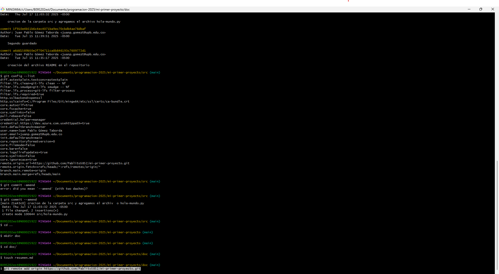

# Listado
- Los pasos a seguir para crear un nuevo repositorio y enlazarlo con el local son: 

- ingresar a git hub en el navegador

- crear una cuenta de github

- creamos un nuevo repositorio 

- lo enlazamos con la consola (git bash) utilizando el comando: git remote add origin https://github.com/Pablito5852/mi-primer-proyecto.git

- utilizar el comanfo git push -u origin main para subir los archivos al repositorio que creamos

